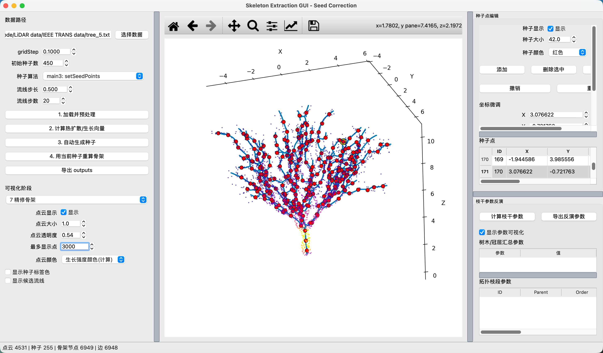
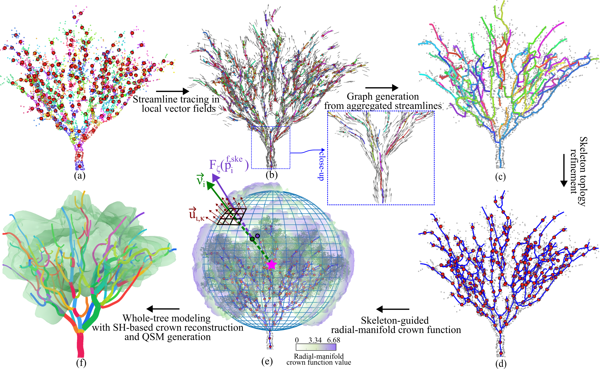

# Whole-Tree Modeling from LiDAR Point Clouds Using Heat-Diffusion-Guided Skeletonization and Spherical-Harmonic Crown Representation

This repository provides the code implementation for:

**Whole-Tree Modeling from LiDAR Point Clouds Using Heat-Diffusion-Guided Skeletonization and Spherical-Harmonic Crown Representation**

The framework reconstructs whole-tree structure from LiDAR point clouds by integrating **heat-diffusion-guided branch skeletonization** and **spherical-harmonic-based crown representation**. It supports unified modeling of woody architecture and crown morphology, including branch skeleton extraction, QSM generation, and crown morphology encoding.

---


## Graphical User Interface

The repository includes a graphical user interface for loading LiDAR point clouds, performing whole-tree modeling, and visualizing reconstruction results.



---

## Method Principle

The principle of the proposed framework is illustrated below. The workflow includes heat-diffusion-based growth-trend estimation, streamline-guided skeleton extraction, QSM reconstruction, and spherical-harmonic crown modeling.



---

## Repository Structure

```text
.
├── app.py
├── pipeline/
├── io_utils/
├── ui/
├── pictures/
│   ├── figure1.png
│   └── figure2.png
├── outputs/
├── cache/
└── README.md
